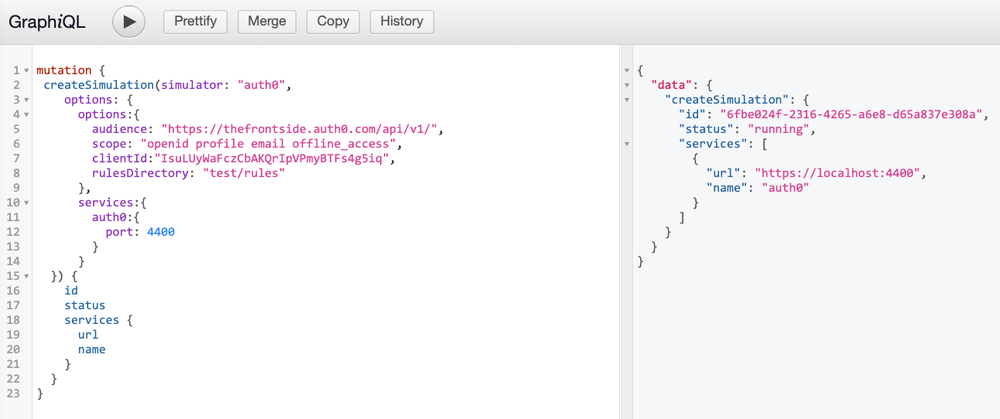

# Auth0 simulator

## Table of Contents
- [Quick Start](#quick-start)
  - [Graphql](#graphql)
  - [code](#code)
- [Configuration](#configuration)
  - [options](#options)
  - [services](#services)
- [Rules](#rules)
- [Endpoints](#endpoints)

Please read the [main README](../../README) for more background on simulacrum.

The auth0 simulator has been initially written to mimic the responses of a real auth0 server that is called from auth0 client libraries like [auth0/react](https://auth0.com/docs/quickstart/spa/react/01-login) and [auth0-spa-js](https://github.com/auth0/auth0-spa-js) that use the openid [authorization code flow](https://developer.okta.com/docs/concepts/oauth-openid/).

If this does not meet your needs then please create a github issue to start a conversation about adding new openid flows.

## Quick start

### Graphql

```bash
npm install
cd ./packages/auth0


PORT=4000 npm run start  // this will start a test simulacrum server at http://localshot:4000
```

Open a browser at [http://localhost:4000](http://localhost:4000).

This will open a graphql graphiql editor.

Enter the following mutation:

```ts
mutation {
 createSimulation(simulator: "auth0", 
  options: {
    options:{
      audience: "[your audience]",
      scope: "[your scope]",
      clientId: "[your client-id]"
    },
    services:{
      auth0:{
        port: 4400
      }
    }
  }) {
    id
    status
    services {
      url
      name
    }
  }
}
```

.

Use the values returned from the query to update your configuration in the client application that calls the auth0 endpoints:

```json
{
  "domain": "localhost:4400",
  "clientId": "00000000000000000000000000000000",
  "audience": "https://your-audience/"
}
```

Create a fake user whose credentials can be used for authentication with this query:

```graphql
mutation{
  given(a: "person", simulation:"6fbe024f-2316-4265-a6e8-d65a837e308a")
}
```


Use the `email` and `password` fields as login credentials.

You now have a running auth0 server!

### code

An auth0 simulator can be created using the `@simulacrum/client` package:

```ts
import { main } from 'effection';
import { createSimulationServer, Server } from '@simulacrum/server';
import { auth0 } from '.';
import { createClient } from '@simulacrum/client';

const port = Number(process.env.PORT) ?? 4400;

main(function*() {
  let server: Server = yield createSimulationServer({
    seed: 1,
    port,
    simulators: { auth0 }
  });

  let url = `http://localhost:${server.address.port}`;

  console.log(`simulation server running at ${url}`);

  let client = yield createClient(url);

  let simulation = yield client.createSimulation(url, {
    options: {
      options:{
        audience: "[your audience]",
        scope: "[your scope]",
        clientId: "[your client-id]"  
      },
      services:{
        auth0:{
          port: 4400
        }
      }
    }
  });

  let person = yield client.given(simulation, "person");

  console.log(`store populated with user`);
  console.log(`username = ${person.email} password = ${person.password}`);

  yield;
});
```

## Configuration

```ts
client.createSimulation(url, {
  options: {
    options:{
      audience: "[your audience]",
      scope: "[your scope]",
      clientId: "[your client-id]",
      rulesDirectory: "test/rules"
    },
    services:{
      auth0:{
        port: 4400
      }
    }
  }
});
```

Both the graphql `createSimulation` mutation and the `@simulacrum/client` take an optional `options` object that consists of the following fields:

### options

The `options` field can contain the [auth0 configuration fields](https://auth0.com/docs/quickstart/spa/vanillajs#configure-auth0) that should match the fields in the  client application that is calling the auth0 server.

An optional [rulesDirectory field](#rules) can specify a directory of [auth0 rules](https://auth0.com/docs/rules) code files, more on this [below](#rules).

### services

The `services` object configures simulators to start on specific ports:

```ts
let simulation = yield client.createSimulation(url, {
  options: {
    services:{
      auth0: {
        port: 4400
      }
    }
  }
});
```

## Rules

It is possible to run [auth0 rules](https://auth0.com/docs/rules) if the compiled code files are on disk and all located in the same directory.

Set the `rulesDirectory` of the [options field](#options) to a path relative to your current working directory.

For example, a [sample rules directory](./test/rules) is in the auth0 package for testing.

If we want to run these rules files then we would add the `rulesDirectory` field to the [options object](#options).

```ts
let simulation = yield client.createSimulation(url, {
  options: {
    options:{
      rulesDirectory: "test/rules"
    }
  }
});
```

## endpoints

The following endpoints have been assigned handlers:

- `/authorize`
- `/login`
- `/u/login`
- `/usernamepassword/login`
- `/login/callback`
- `/oauth/token`
- `/v2/logout`
- `/.well-known/jwks.json`
- `/.well-known/openid-cofiguration`